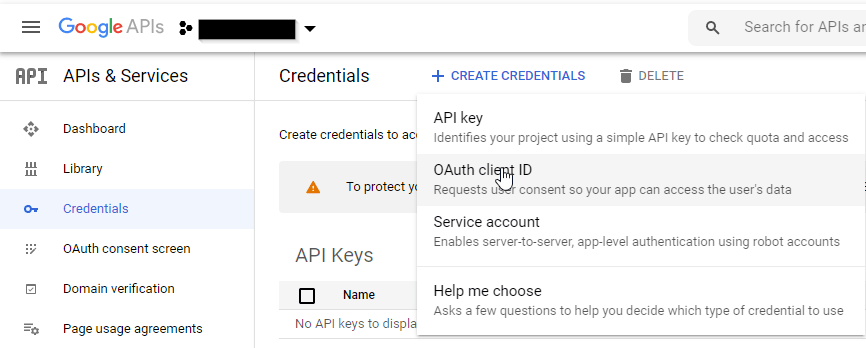
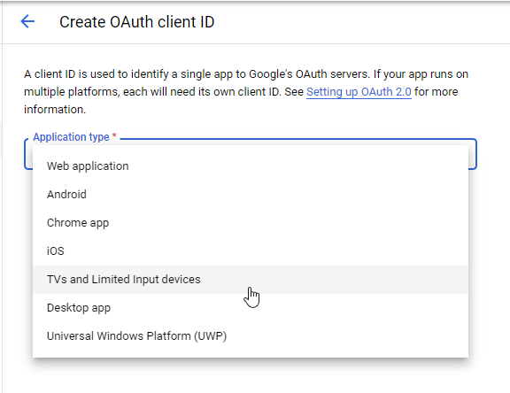
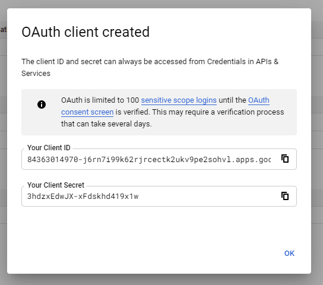
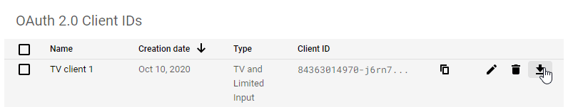

# Setup Google Calendar API connection

1. Add one of the nodes you want to use to your flow.
2. Double-click the new node so that configuration page opens.
3. In the "Credentials"-combo box, select "Add new ... config" and click on the pen icon.
4. After giving a readable name, you are asked to insert your api client information. To retrieve it, go to [Google Developer Console](https://console.developers.google.com/) select (or create) your project.
5. Then go to "Credentials" and add a new OAuth Client-ID.

6. Select __TVs and Limited Input devices__

7. After creation you can see your Client-ID and Client-Key. You can copy those or hit OK and download them on the next screen.

8. Open the downloaded json file, and enter the client id and client secret. The redirectURI should have an array with two values. Copy the URN.